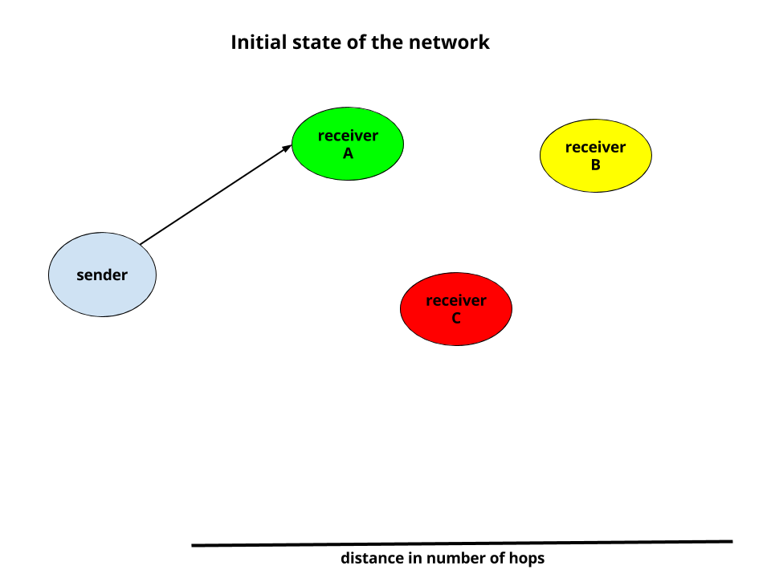
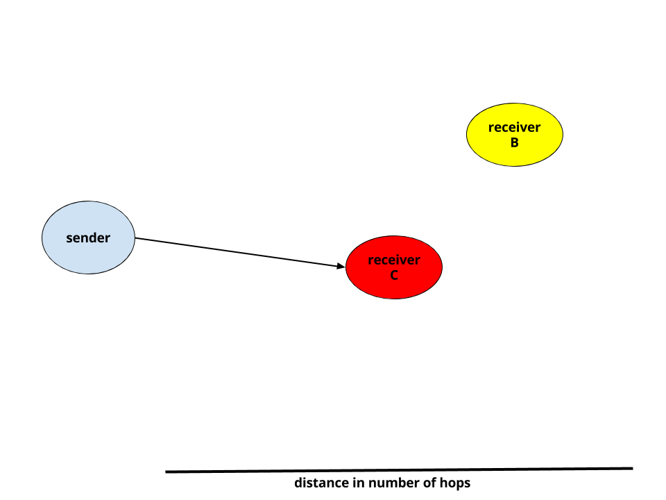
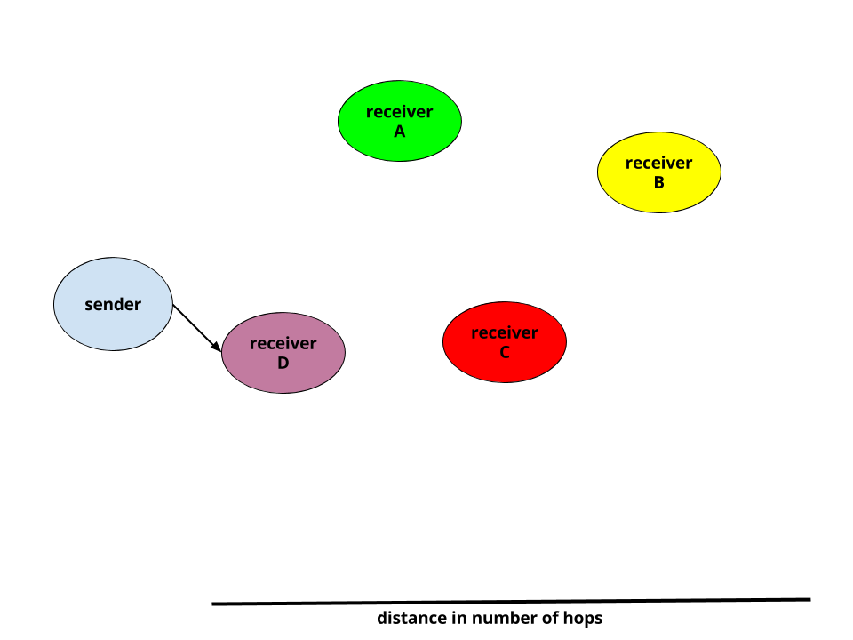
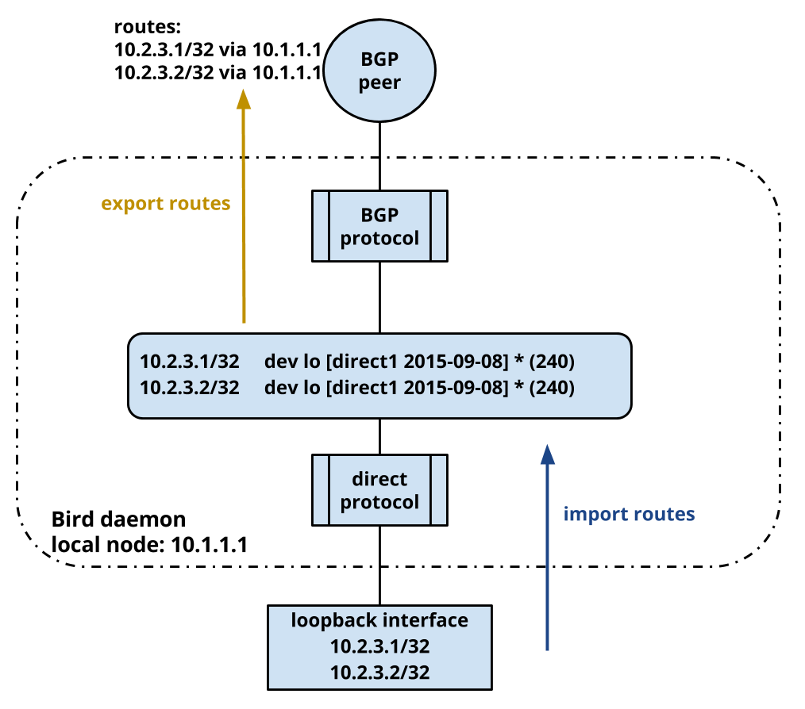
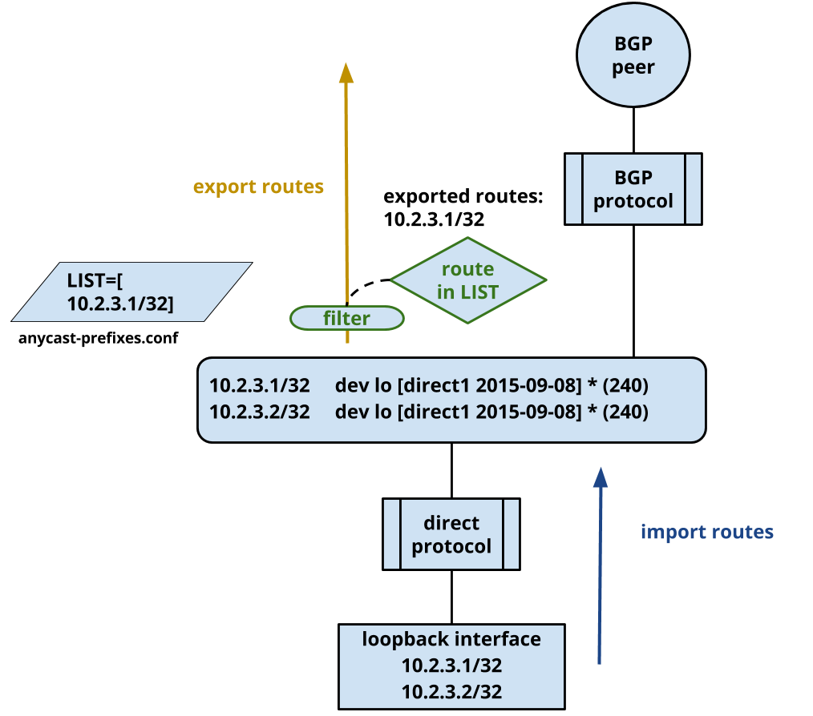

.. anycast_healthchecker
.. README.rst

=====================
anycast-healthchecker
=====================

    *A healthchecker for Anycasted services.*

.. contents::

Introduction
------------

**anycast-healthchecker** monitors a service by doing periodic health checks
and based on the result instructs `Bird`_ daemon to either advertise or
withdraw the route to reach the monitored service. As a result Bird will only
advertise routes for healthy services.

Bird must be configured in a certain way to interface properly with
anycast-healthchecker. The configuration is detailed later in this document.

anycast-healthchecker is a Python program, which uses the `daemon`_ library
to implement a well-behaved Unix daemon process and threading to run
multiple service checks in parallel.

What is Anycast
---------------

Anycast is a network address scheme where traffic from a sender has more than
one potential receivers, but only one of them receives it. Routing protocols,
decide which one of the potential receivers will actually receive traffic based
on the topology of the network. The main attribute which contributes to the
decision is the cost of the network path between a sender and a receiver.

Cost is a protocol specific (usually integer) value that only has meaning
within a protocol that is used as a metric of distance. Routing protocols
provide default values for common topologies (`BGP`_ associates the
cost of a path with the number of autonomous systems between the sender and the
receiver, `OSPF`_ calculates the default cost based on the bandwidth of links),
but its main use is to allow administrative control over traffic flow by
specifying cost according to business needs.

The nearest receiver to a sender always receives the traffic and this only
changes if something changes on the network, another receiver with best path to
the sender appears or current receiver disappears. If multiple receivers have
the same distance from the sender more than one of the receivers might receive
traffic, based on further details of the network configuration.

The three drawings below exhibit how traffic is routed between a sender and
multiple potential receivers when something changes on network. In this example
BGP routing protocol is used:

These potential receivers use `BGP`_ or `OSPF`_ by running an Internet Routing
daemon, Bird or Quagga, to simultaneously announce the same destination IP
address from different places on the network. Due to the nature of Anycast
receivers can be located on any network across a global network infrastructure.

Anycast doesn't balance traffic as only one receiver attracts traffic from
senders. For instance, if there are two receivers which announce the same
destination IP address in certain location, traffic will be distributed across
those two receivers unevenly as senders can be spread across the network in an
uneven way.

Anycast is being used as a mechanism to switch traffic between and within
data-centers for the following main reasons:

* the switch of traffic occurs without the need to enforce a change to clients

In case of loss of a service in one location, traffic to that location will be
switched to another data-center without any manual intervention and most
importantly without pushing a change to clients which you don't always control.

* the switch happens within few milliseconds

The same technology can be used for balancing traffic using
`Equal-Cost Multi-Path`_.

ECMP routing is a network technology where traffic can be routed over multiple
paths. In the context of routing protocols, path is the route a packet has to
take in order to be delivered to a destination. Because these multiple paths
have the same cost, traffic is balanced across them.

This provides the possibility to perform load-balancing of traffic across
multiple servers. Routers are the devices which perform load-balancing of
traffic and most of them use a deterministic way to select the server based on
the following four properties of IP packets:

* source IP
* source PORT
* destination IP
* destination PORT

Each unique combination of values for those four properties is called network
flow. For each different network flow a different destination server is
selected so traffic is evenly balanced across all servers.
These servers run an Internet Routing daemon in the same way as with Anycast
case but with the major difference that all servers receive traffic.

The main characteristic of this type of load-balancing is that is stateless.
Router balances traffic to a destination IP address based on the quadruple
network flow without the need to understand and inspect protocols above Layer 3.
As a result it is very cheap in terms of resources and very fast at the same
time. This is commonly advertised as traffic balancing at wire-speed.

**anycast-healthchecker** can be utilized in Anycast and ECMP environments.

How anycast-healthchecker works
-------------------------------

The current release of anycast-healthchecker supports only the Bird daemon which
you have to configure in a specific way. Thus, it is mandatory to explain very
briefly how Bird handles advertisements for routes.

Bird maintains a routing information base (`RIB`_) and various protocols
import/export routes to/from it. The diagram below illustrates how Bird
advertises routes for IPs assigned to the loopback interface to the rest of the
network using BGP protocol. Bird can also import routes learned via BGP/OSPF
protocols, but this part of the routing process is irrelevant to the functionality of
anycast-healthchecker.

A route is always associated with a service which runs locally on the box.
The Anycasted service is a daemon (HAProxy, Nginx, Bind etc) which processes
incoming traffic and listens to an IP (Anycast Service Address) for which a
route exists in the RIB and advertised by Bird.

As it is exhibited in the above diagram a route is advertised only when:

#. The IP is assigned to the loopback interface.
#. `direct`_ protocol from Bird imports a route for that IP in the RIB.
#. BGP/OSPF protocols export that route from the RIB to a network peer.

The route associated with the Anycasted service must be either advertised or
withdrawn based on the health of the service, otherwise traffic will always
be routed to the local node regardless of the status of the service.

Bird provides `filtering`_ capabilities with the help of a simple programming
language. A filter can be used to either accept or reject routes before they
are exported from the RIB to the network.

A list of IP prefixes (<IP>/<prefix length>) is stored in a text file.
IP prefixes that **are not** included in the list are filtered-out and they
**do not** get exported from the RIB to the network. The white-list text file
is sourced by Bird upon startup, reload and reconfiguration.
The following diagram illustrates how this technique works:

This configuration logic allows a separate process to update the list by adding
or removing IP prefixes and trigger a reconfiguration of Bird in order to advertise
or withdraw routes.  **anycast-healthchecker** is that separate process. It monitors
Anycasted services and based on the status of the health checks updates the list
of IP prefixes.

Bird does not allow the definition of a list with no elements and when that happens
Bird will emit an error and refuses to start. Because of this anycast-healthchecker
makes sure that there is always an IP prefix in the list, see ``dummy_ip_prefix``
configuration option in `Daemon section`_.

Configuring anycast-healthchecker
---------------------------------

Because anycast-healthchecker is very much tied in with Bird daemon, the
configuration of Bird is explained first. Next, the configuration of
anycast-healthchecker (including the configuration for the health checks) is
covered and finally the options for invoking the program from the command
line will be described.

Bird configuration
##################

The logic described in `How anycast-healthchecker works`_ can be accomplished
by configuring:

#. an ``include`` statement to source other configuration files in
   ``bird.conf``
#. a function, ``match_route``, as an export filter for the routing
   protocol (BGP or OSPF)
#. a list of IP prefixes for routes which allowed to be exported by Bird

anycast-healthchecker **does not** install any of the files mentioned in this
section.

bird.conf
*********

The most important parts are the lines ``include "/etc/bird.d/*.conf";`` and
``export where match_route();``. The former statement causes inclusion of files
and the latter forces all routes to pass from the ``match_route`` function before
they are exported. BGP protocol is used in the below bird configuration example
but OSPF protocol can be used as well::

    include "/etc/bird.d/*.conf";
    protocol device {
        scan time 10;
    }
    protocol direct direct1 {
        interface "lo";
            export none;
            import all;
    }
    template bgp bgp_peers {
        import none;
        export where match_route();
        local as 64815;
    }
    protocol bgp BGP1 from bgp_peers {
        disabled no;
        neighbor 10.248.7.254 as 64814;
    }

match-route.conf
****************

``match-route.conf`` file configures the ``match_route`` function which performs
the white and black listing of IP prefixes by looking up the IP prefix of the
route in a list and accepts the export if it finds a matching entry::

    function match_route()
    {
        return net ~ ACAST_PS_ADVERTISE;
    }

anycast-prefixes.conf
*********************

``anycast-prefixes.conf`` file defines a list of IP prefixes which is stored in
a variable with the name ``ACAST_PS_ADVERTISE``. The name of the variable can
be anything meaningful but ``bird_variable`` setting **must** be changed
accordingly in order for anycast-healthchecker to modify it.

``anycast-prefixes.conf`` file is not part of the anycast-healthchecker
package, thus administrators need install an initial version with the following
content and after the launch of anycast-healthchecker it **should not**
modified by any other process(es) as its content is managed by
anycast-healthchecker.

::

    define ACAST_PS_ADVERTISE =
        [
            10.189.200.255/32
        ];

anycast-healthchecker daemon removes IP prefixes from the list for which a
service check is not configured. But, the IP prefix set in ``dummy_ip_prefix``
does not need a service check configuration.

Configuring the daemon
######################

anycast-healthchecker uses the popular `INI`_ format for its configuration files.
This is an example configuration file for the daemon
(/etc/anycast-healthchecker.conf)::

    [DEFAULT]
    interface            = lo

    [daemon]
    pidfile              = /var/run/anycast-healthchecker/anycast-healthchecker.pid
    bird_conf            = /etc/bird.d/anycast-prefixes.conf
    bird_variable        = ACAST_PS_ADVERTISE
    bird_reconfigure_cmd = sudo /usr/sbin/birdc configure
    loglevel             = debug
    log_maxbytes         = 104857600
    log_backups          = 8
    log_file             = /var/log/anycast-healthchecker/anycast-healthchecker.log
    stderr_file          = /var/log/anycast-healthchecker/stderr.log
    stdout_file          = /var/log/anycast-healthchecker/stdout.log
    dummy_ip_prefix      = 10.189.200.255/32
    purge_ip_prefixes    = false

Above settings are used as defaults when daemon is launched without a
configuration file. The daemon **does not** need to run as root as long as it
has sufficient privileges to modify the Bird configuration (anycast-prefixes.conf)
and trigger a reconfiguration of Bird by running ``birdc configure``.
In the above example ``sudo`` is used for that purpose (``sudoers`` file has
been modified for that purpose).

DEFAULT section
***************

Below are the default settings for all service checks, see `Configuring checks
for services`_ for an explanation of the parameters. Settings in this section
can be overwritten in other sections.

:interface: lo
:check_interval: 10
:check_timeout: 2
:check_rise: 2
:check_fail: 2
:check_disabled: true
:on_disable: withdraw
:ip_check_disabled: false

Daemon section
**************

Settings for anycast-healthchecker daemon

* **pidfile** Defaults to **/var/run/anycast-healthchecker/anycast-healthchecker.pid**

File to store the process id of the daemon

* **bird_conf** Defaults to **/etc/bird.d/anycast-prefixes.conf**

File with the list of IP prefixes allowed to be exported

* **bird_variable** Defaults to **ACAST_PS_ADVERTISE**

The name of the list defined in ``bird_conf``

* **bird_reconfigure_cmd** Defaults to **sudo /usr/sbin/birdc configure**

Command to trigger a reconfiguration of Bird daemon

* **loglevel** Defaults to **debug**

Log level to use, possible values are: debug, info, warning, error, critical

* **log_file** Defaults to **/var/log/anycast-healthchecker/anycast-healthchecker.log**

File to log messages to

* **log_maxbytes** Defaults to **104857600** (bytes)

Maximum size in bytes for log files

* **log_backups** Defaults to **8**

Number of old log files to maintain

* **stderr_file** Defaults to **/var/log/anycast-healthchecker/stderr.log**

File to redirect standard error to

* **stdout_file** Defaults to **/var/log/anycast-healthchecker/stdout.log**

File to redirect standard output to

* **dummy_ip_prefix** Defaults to **10.189.200.255/32**

An IP prefix in the form <IP>/<prefix length> which will be always available in
the list defined by ``bird_variable`` to avoid having an empty list.
The ``dummy_ip_prefix`` **must not** be used by any service or assigned to the
interface set with ``interface`` or configured anywhere on the network as
anycast-healthchecker **does not** perform any checks for it.

* **purge_ip_prefixes** Defaults to **false**

Purge IP-Prefixes from ``bird_conf`` on start-up which don't have a service check associated with them.

NOTE: These IP-Prefixes are always removed from ``bird_conf`` when
``bird_conf`` is updated during the life time of the daemon.
``purge_ip_prefixes`` is considered only during start-up and was introduced in
order to be compatible with previous behavior, which didn't remove those
IP-Prefixes on start-up.

JSON logging
************

anycast-healthchecker daemon can be configured to send logging messages over
HTTP to a central place in addition to write them to log files.
It builds a JSON blob with a specific data structure, which **is not**
configurable at the moment.

The following settings can be added to the [daemon] section for enabling
JSON logging.

* **json_logging** Defaults to **false**

``true`` enables JSON logging ``false`` disables it

* **http_server** Unset by default

Server name to send JSON logging over HTTP protocol

* **http_server_port**  Unset by default

Port to connect

* **http_server_protocol** Unset by default

HTTP protocol to use, either ``http`` or ``https``

* **http_server_timeout** Unset by default

How long to wait for the server to send data before giving up, as a float number.
JSON messages are send using http POST requests which are executed in blocking
mode which means that possible long delays will make the health checks to be
delayed as well.
``http_server_timeout`` accepts floating point numbers as values which are
passed to underlying request module as a single timeout which will be applied
to both the connect and the read timeouts.

Configuring checks for services
###############################

The configuration for a single service check is defined in one section.
Here is an example::

    [foo.bar.com]
    check_cmd       = /usr/bin/curl --fail --silent http://10.52.12.1/
    check_interval  = 10
    check_timeout   = 2
    check_fail      = 2
    check_rise      = 2
    check_disabled  = false
    on_disabled     = withdraw
    ip_prefix       = 10.52.12.1/32

The name of the section becomes the name of the service check and appears in
the log files for easier searching of error/warning messages.

* **check_cmd** Unset by default

The command to run to determine the status of the service based
**on the return code**. Complex health checking should be wrapped in a script.
When check command fails, the stdout and stderr appears in the log file.

* **check_interval** Defaults to **2** (seconds)

How often to run the check

* **check_timeout** Defaults to **2** (seconds)

Maximum time in seconds for the check command to complete.
anycast-healthchecker will try kill the check if it doesn't return after
*check_timeout* seconds. If *check_cmd* runs under another user account (root)
via sudo then it wouldn't be killed.  anycast-healthchecker could run as root
to overcome this problem, but it is highly recommended to run it as normal user.

* **check_fail** Defaults to **2**

A service is considered DOWN after this many consecutive unsuccessful health
checks

* **check_rise** Defaults to **2**

A service is considered HEALTHY after this many consecutive successful health
checks

* **check_disabled** Defaults to **false**

``true`` disables the check, ``false`` enables it

* **on_disable** Defaults to **withdraw**

What to do when check is disabled, either ``withdraw`` or ``advertise``

* **ip_prefix** Unset by default

IP prefix associated with the service. It **must be** assigned to the
interface set in ``interface`` parameter unless ``ip_check_disabled`` is set to
``true``

* **ip_check_disabled** Defaults to **false**

``true`` disables the assignment check of ``ip_prefix`` to the interface set in
``interface``, ``false`` enables it.

If the ``check_cmd`` checks the availability of the service by sending a
request to the Anycasted IP address then that request may be served by another
node which advertises the same IP address on the network. This usually happens
when the Anycasted IP address is not assigned to loopback or any other
interface on the local node.

Therefore, it should be only enabled in environments where the network or the
network configuration of the local node prevents the request from ``check_cmd``
to be forwarded to another node.

* **interface** Defaults to **lo**

The name of the interface that ``ip_prefix`` is assigned to

Multiple sections may be combined in one file or provide one file per section.
File must be stored under one directory and their name should use ``.conf``
as suffix (foo.bar.com.conf).

Starting the daemon
###################

Daemon CLI usage::

    anycast-healthchecker --help
    A simple healthchecker for Anycasted services.

    Usage:
        anycast-healthchecker [-f <file> -d <directory> -c ] [-p | -P]

    Options:
        -f, --file <file>  configuration file with settings for the daemon
                           [default: /etc/anycast-healthchecker.conf]
        -d, --dir <dir>    directory with configuration files for service checks
                           [default: /etc/anycast-healthchecker.d]
        -c, --check        perform a sanity check on configuration
        -p, --print        show default settings for daemon and service checks
        -P, --print-conf   show configuration
        -v, --version      show version
        -h, --help         show this screen

The daemon can be launched by supplying a configuration file and a directory
with configuration files for service checks::

  anycast-healthchecker -f ./anycast-healthchecker.conf -d ./anycast-healthchecker.d

At the root of the project there is System V init and a Systemd unit file for
proper integration with OS startup tools.

Systemd and SysVinit integration
################################

Under contrib/systemd and contrib/SysVinit directories there are the necessary
Unit service and startup files which can be used to start the daemon on boot.

Nagios check
############

Under contrib/nagios directory there is a nagios plugin to check if daemon is
up and if all threads are running.

Installation
------------

Use pip::

    pip install anycast-healthchecker

From Source::

   sudo python setup.py install

Build (source) RPMs::

   python setup.py clean --all; python setup.py bdist_rpm

Build a source archive for manual installation::

   python setup.py sdist

Release
-------

#. Bump version in anycast_healthchecker/__init__.py

#. Commit above change with::

      git commit -av -m'RELEASE 0.1.3 version'

#. Create a signed tag, pbr will use this for the version number::

      git tag -s 0.1.3 -m 'bump release'

#. Create the source distribution archive (the archive will be placed in the **dist** directory)::

      python setup.py sdist

#. pbr will update ChangeLog file and we want to squeeze them to the previous commit thus we run::

      git commit -av --amend

#. Move current tag to the last commit::

      git tag -fs 0.1.3 -m 'bump release'

#. Push changes::

      git push;git push --tags

Development
-----------
I would love to hear what other people think about **anycast_healthchecker** and provide
feedback. Please post your comments, bug reports and wishes on my `issues page
<https://github.com/unixsurfer/anycast_healthchecker/issues>`_.

Testing
#######

At the root of the project there is a `local_run.sh` script which you can use
for testing purposes. It does the following:

#. Creates the necessary directory structure under $PWD/var to store
   configuration and log files

#. Generates configuration for the daemon and for 2 service checks

#. Generates bird configuration(anycast-prefixes.conf)

#. Installs anycast-healthchecker with ``python3.4 setup.py install``,
   *requires* python virtualenvironment, use the excellent tool virtualenvwrapper

#. Assigns 4 IP addresses (10.52.12.[1-4]) to loopback interface

#. Checks if bird daemon runs but it does not try to start if it's running

#. Starts the daemon as normal user and not as root

Requirements for running local_run.sh and having a workable setup

#. python3.4 installation available

#. Bird installed and configured as it is mentioned in `Bird configuration`_

#. sudo access to run sudo birdc configure

#. sudo access to assign IPs on the loopback interface

Contributers
############

The following people have contributed to project with feedback, commits and
code reviews

- Károly Nagy (@charlesnagy)
- Nick Demou (@ndemou)
- Ralf Ertzinger (@alufu)

Licensing
---------

Apache 2.0

Acknowledgement
---------------
This program was originally developed for Booking.com.  With approval
from Booking.com, the code was generalised and published as Open Source
on github, for which the author would like to express his gratitude.

Contacts
--------

**Project website**: https://github.com/unixsurfer/anycast_healthchecker

**Author**: Pavlos Parissis <pavlos.parissis@gmail.com>

.. _Bird: http://bird.network.cz/
.. _BGP: https://en.wikipedia.org/wiki/Border_Gateway_Protocol
.. _OSPF: https://en.wikipedia.org/wiki/Open_Shortest_Path_First
.. _Equal-Cost Multi-Path: https://en.wikipedia.org/wiki/Equal-cost_multi-path_routing
.. _direct: http://bird.network.cz/?get_doc&f=bird-6.html#ss6.4
.. _filtering: http://bird.network.cz/?get_doc&f=bird-5.html
.. _RIB: https://en.wikipedia.org/wiki/Routing_table
.. _INI: https://en.wikipedia.org/wiki/INI_file
.. _daemon: https://pypi.python.org/pypi/python-daemon/
